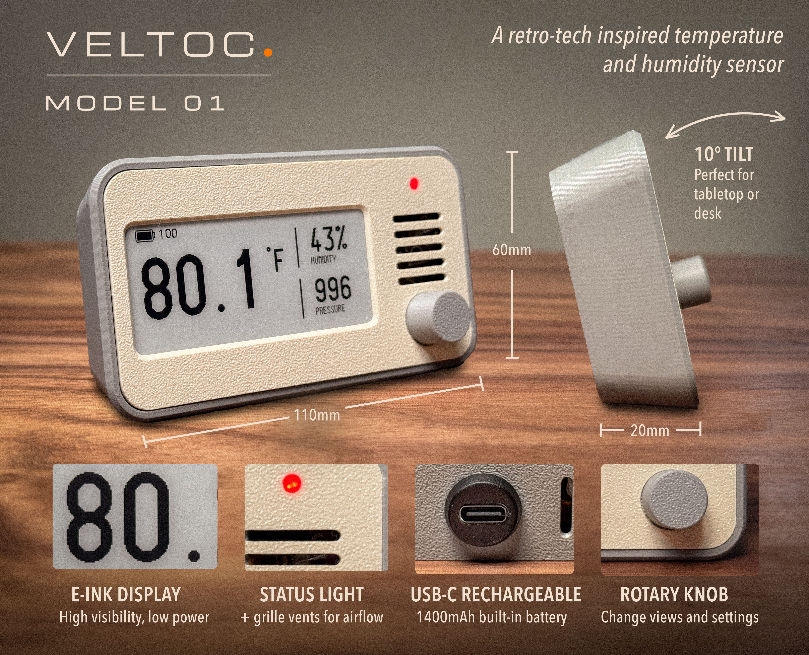
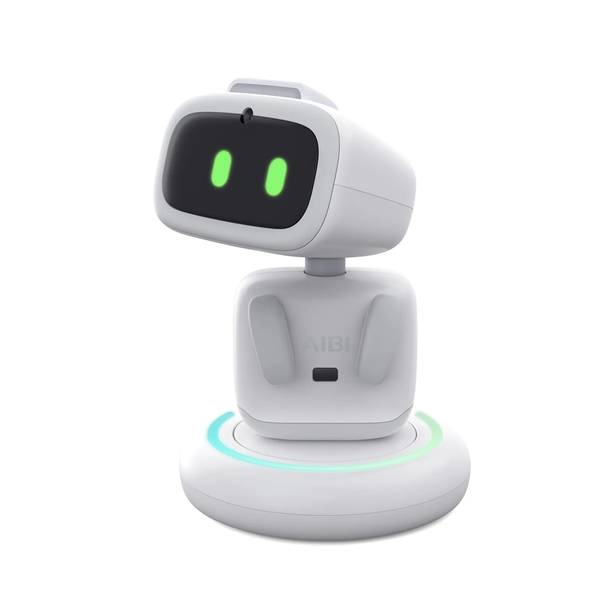

# IoT Project Proposals

## 1. Smart Trash Bin

### Idea
A small wheeled trash bin that can move toward the user when called.

### How It Works
The user calls the bin by its name or a specific voice command. Microphones detect the direction of the sound, and the bin moves toward the user.

### Possible Components
- Microcontroller
- Microphone(s)
- Motors and wheels
- Battery

---

## 2. Smart Stove & Oven Safety Monitor

### Idea
A small IoT device for monitoring stoves and ovens, which are often integrated into the same appliance in Finnish homes.

### Main Features
- Detect stove or oven left on
- Monitor abnormal temperature
- Detect possible overheating or fire
- Send notifications to the user's phone

### How It Works
Sensors → ESP32 → Wi-Fi / MQTT → Server → Phone

The system uses external temperature or thermal sensors, so it does not need to connect to 230 V power or be placed inside the oven.

### Possible Components
- ESP32
- Temperature / thermal sensor
- Buzzer / LED
- Wi-Fi / MQTT
- Server

---

## 3. Smart Aquarium

**Status:** Project concept

### Idea
Build a small smart aquarium that can monitor and automatically manage the aquarium.

### Main Features
- Monitor water temperature, water level and water quality
- Automatic fish feeding
- Automatic water change using pumps
- Optional web interface / mobile app

### Possible Components
- ESP32
- Temperature sensor
- Water level sensor
- Water quality sensors (pH / turbidity / TDS)
- Water pump
- Servo motor
- Water tank and tubing

The project combines sensors, data collection, automation and actuators in a relatively simple and visually interesting prototype. More advanced features can be added if there is enough time.

---

## 4. E-Ink Desktop Gadget

A small and attractive desktop device that displays environmental information and useful daily information such as weather, calendar, tasks, and habits.

**Main features:** temperature/humidity and optional air-quality monitoring, E-Ink display, Wi-Fi connectivity, weather, calendar, and task/habit reminders.

Reference Project: https://github.com/danking6/veltoc

---

## 5. Desktop AI Robot

A small desktop robot that monitors its environment and interacts with the user through voice and AI. It can manage tasks and habits, answer questions using an LLM, and respond through a display, speaker, and simple movement.

**Main features:** environmental sensors, microphone, STT, LLM, TTS, display, speaker, and servo-controlled movement.
